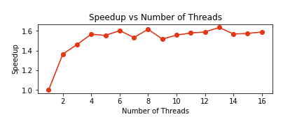

# Matrix Multiplication Performance Benchmark

## Introduction

The "Matrix Multiplication Performance Benchmark" project aims to thoroughly assess the impact of multi-threading on the efficiency of matrix multiplication operations. Matrix multiplication is a fundamental mathematical operation widely used in various fields such as mathematics, physics, engineering, and computer science. The performance of matrix multiplication can significantly influence the overall efficiency of computational tasks, especially in applications involving large-scale data processing and numerical simulations.

This project explores how parallelization techniques, specifically multi-threading, can improve the performance of matrix multiplication algorithms. By leveraging Python libraries such as NumPy, threading, and Pandas, the project conducts extensive benchmarking experiments to analyze the effects of multi-threading on computation time and CPU utilization. The findings of this investigation are crucial for understanding the scalability and efficiency of matrix multiplication algorithms in multi-core computing environments.

## Functionality

The project encompasses several key functionalities, each serving a specific purpose in the benchmarking process:

### 1. Matrix Generation
The generate_random_matrices(num_matrices, matrix_size) function creates a specified number of random matrices of a given size. These matrices are used as the input for experiments that benchmark matrix multiplication performance. By generating matrices in various sizes and quantities, the project evaluates how different computational loads affect the performance of matrix multiplication algorithms.

### 2. Matrix Multiplication
The multiply_matrices(matrices) function is key for implementing matrix multiplication. It takes a list of matrices and sequentially multiplies them, starting from a fixed matrix. This function is used as a standard to compare against more complex, multi-threaded matrix multiplication implementations. Tracking the time it takes to complete these multiplications helps in assessing the impact of multi-threading on speeding up the computation.

### 3. Multi-Threading
The perform_multiplication_with_threads(num_threads, matrices) function enables multi-threaded matrix multiplication. It divides the matrix multiplication workload across multiple threads, enabling parallel processing on multi-core processors. By adjusting the number of threads and noting the changes in execution time, the project measures how well multi-threading enhances the efficiency and scalability of matrix multiplication.

### 4. CPU Core Detection
To determine the number of CPU cores available, the project uses the multiprocessing.cpu_count() function from the multiprocessing library. This data is essential for setting the maximum number of threads in multi-threaded matrix multiplication experiments. Utilizing all available CPU cores, the project seeks to optimize parallelization and resource use, aiming for the highest possible computational efficiency.
## Methodology

The benchmarking methodology employed by the project involves several key steps:

1. **Matrix Generation**: Random matrices of varying sizes and quantities are generated using NumPy's random number generation capabilities. These matrices serve as the input data for matrix multiplication experiments.

2. **Benchmarking**: The project conducts benchmarking experiments to evaluate the performance of matrix multiplication algorithms. By varying the number of threads and observing the corresponding changes in execution time, the project assesses the impact of multi-threading on computation speed and efficiency.

3. **Performance Analysis**: The benchmarking results are analyzed to gain insights into the scalability and effectiveness of multi-threading in accelerating matrix multiplication operations. Performance metrics such as execution time, speedup, efficiency, and CPU utilization are computed and evaluated to provide a comprehensive assessment of multi-threaded matrix multiplication algorithms.

## Findings

The findings of the benchmarking experiments provide valuable insights into the performance characteristics of multi-threaded matrix multiplication algorithms. Key findings include:

- The impact of multi-threading on computation time and efficiency.
- The scalability of multi-threaded matrix multiplication with increasing thread counts.
- The relationship between CPU utilization and the number of threads used for computation.

## Visualizations

The project utilizes visualizations to present the benchmarking results in a clear and informative manner. Key visualizations include:

1. **Thread vs Time Taken**: A line plot illustrating the relationship between the number of threads and the execution time of matrix multiplication operations. This visualization highlights how multi-threading affects computation speed and efficiency.  

3. **CPU Usage vs Threads**: A line plot depicting CPU utilization over the course of matrix multiplication experiments. This visualization provides insights into how effectively CPU cores are utilized during multi-threaded computation tasks.  

5. **Efficiency and speedup**: A line plot showing the relationship between the number of threads and the efficiency and speedup over the course of matrix multiplication experiments.  

 

## Conclusion

The "Matrix Multiplication Performance Benchmark" project contributes to the understanding of how multi-threading influences the efficiency of matrix multiplication operations. By conducting comprehensive benchmarking experiments and analyzing performance metrics, the project sheds light on the scalability, effectiveness, and resource utilization of multi-threaded matrix multiplication algorithms. The insights gained from this project can inform the design and optimization of computational tasks involving matrix calculations, leading to improved performance and efficiency in various applications.

## Submitted By:

- **Name:** Sahil Manchanda  
- **Roll Number:** 102103134  
- **Course:** 3CO5

This README provides a detailed overview of the Matrix Multiplication Performance Benchmark project, outlining its functionality, methodology, findings, and conclusions.
